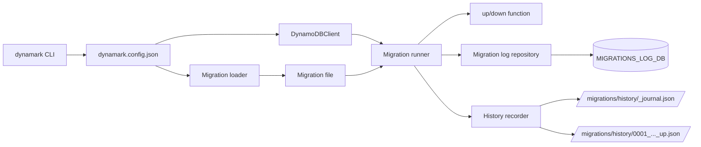

# dynamark

[](https://github.com/Gizmodlabs/dynamark/actions/workflows/ci.yml)
[](package.json)
[](package.json)
[](LICENSE)

`dynamark` is a DynamoDB data migration CLI for TypeScript and JavaScript projects.

This v1 release uses Node 24+, pnpm, AWS SDK for JavaScript v3, `dynamark.config.json`, runtime config validation, Vite builds, and Vitest coverage.

## Install the CLI

```bash
npm install -g dynamark
```

```bash
dynamark --help
```

Migration files import the AWS SDK, so install it in the project that holds your migrations too:

```bash
npm install @aws-sdk/client-dynamodb
```

## Create a Migration Project

```bash
dynamark init
```

`init` creates:

- `dynamark.config.json`
- `migrations/`

The generated `dynamark.config.json` starts as:

```json
{
  "awsConfig": [
    {
      "profile": "",
      "region": "us-west-2",
      "endpoint": "",
      "accessKeyId": "",
      "secretAccessKey": ""
    }
  ],
  "migrationsDir": "migrations",
  "migrationType": "ts",
  "historyDir": "migrations/history"
}
```

For real AWS, leave `endpoint`, `accessKeyId`, and `secretAccessKey` blank and Dynamark uses the standard AWS credential chain: env vars, `~/.aws` profiles, SSO, GitHub Actions OIDC, and ECS/EC2 roles. Pass `--profile <name>` (or set `AWS_PROFILE`) to pick a named profile.

## Run Against DynamoDB Local

Start DynamoDB Local:

```bash
docker run -d -p 8000:8000 --name local-dynamodb amazon/dynamodb-local
```

Set throwaway local credentials for AWS CLI calls:

```bash
export AWS_ACCESS_KEY_ID=local
export AWS_SECRET_ACCESS_KEY=local
export AWS_DEFAULT_REGION=us-west-2
```

Create a local table you can use in a migration:

```bash
aws dynamodb create-table \
  --table-name TestTable \
  --attribute-definitions AttributeName=id,AttributeType=S \
  --key-schema AttributeName=id,KeyType=HASH \
  --billing-mode PAY_PER_REQUEST \
  --endpoint-url http://localhost:8000
```

Confirm DynamoDB Local is responding:

```bash
aws dynamodb list-tables --endpoint-url http://localhost:8000
```

Point `dynamark.config.json` at the local endpoint:

```json
{
  "awsConfig": [
    {
      "profile": "",
      "region": "us-west-2",
      "endpoint": "http://localhost:8000",
      "accessKeyId": "local",
      "secretAccessKey": "local"
    }
  ],
  "migrationsDir": "migrations",
  "migrationType": "ts",
  "historyDir": "migrations/history"
}
```

## Run Migrations

Create a migration:

```bash
dynamark create add-test-row
```

Example TypeScript migration:

```ts
import type { DynamoDBClient } from "@aws-sdk/client-dynamodb";
import { DeleteItemCommand, PutItemCommand } from "@aws-sdk/client-dynamodb";

export async function up(ddb: DynamoDBClient): Promise<void> {
  await ddb.send(
    new PutItemCommand({
      TableName: "TestTable",
      Item: {
        id: { S: "row-1" }
      }
    })
  );
}

export async function down(ddb: DynamoDBClient): Promise<void> {
  await ddb.send(
    new DeleteItemCommand({
      TableName: "TestTable",
      Key: {
        id: { S: "row-1" }
      }
    })
  );
}
```

Run and inspect migrations:

```bash
dynamark up
dynamark status
dynamark down --shift 1
```

`dynamark up` creates `MIGRATIONS_LOG_DB` automatically if it does not exist. That table stores the migration filename and applied timestamp.

`--shift` takes a whole number of migrations to roll back. `--shift 0` rolls back everything.

Only files with the configured `migrationType` extension count as migrations, so files like `.gitkeep` or `README.md` in the migrations directory are ignored.

## Running Safely in Production

**One run at a time.** `up` and `down` take a lock (a row in `MIGRATIONS_LOG_DB`) before reading what's pending. If two deploys start together, the second fails fast with "Another dynamark run holds the migration lock". The lock renews itself while a run is in progress, and a lock left by a crashed run expires within 60 seconds.

**Write migrations that are safe to run twice.** DynamoDB can't wrap your migration and its log entry in one transaction. Dynamark runs `up()` first and then writes the log row, so if that write fails, the migration runs again next time. Use condition expressions (for example `attribute_not_exists`) or check-before-write so a second run is harmless.

## Migration Run History

Every `up` and `down` run that touches at least one migration is recorded locally as files, similar to Drizzle's journal. The history directory defaults to `<migrationsDir>/history` and can be changed with `historyDir` in `dynamark.config.json`.

Each run produces:

- An entry appended to `_journal.json`, the index of all runs.
- An immutable per-run file like `0001_20260612T100001250Z_up.json` containing the action, profile, files touched, timestamps, duration, result, and the error message when a run fails.

Failed runs are recorded too, including the files that completed before the failure, so partial migrations leave an audit trail. History recording never breaks a migration run; if the journal cannot be written, Dynamark warns and continues.

Inspect the history from the CLI:

```bash
dynamark history
```

Or programmatically (for example behind an HTTP endpoint):

```ts
import { historyAction } from "dynamark";

const runs = await historyAction();
```

Commit the history directory to git to keep a reviewable, permanent record of what ran where and when.

## Runtime Flow



## Build and Test This Repo

Use Node 24+ and pnpm 10+.

```bash
pnpm install
pnpm run check-types
pnpm test
pnpm run build
pnpm run check
```

The default test suite uses Vitest and an in-process Dynalite server for fast local and CI feedback.

To test against the Docker DynamoDB Local container on `localhost:8000`:

```bash
docker run -d -p 8000:8000 --name local-dynamodb amazon/dynamodb-local
pnpm run test:local:dynamodb
```

The Docker smoke test owns and resets `DYNAMARK_LOCAL_TEST` and `MIGRATIONS_LOG_DB` inside DynamoDB Local.

### Manual Testing Without Docker

```bash
pnpm run mock:dynamodb
```

This starts an in-memory DynamoDB mock (Dynalite) on `http://127.0.0.1:8000` and prints a ready-to-paste `dynamark.config.json`. In another terminal, point a scratch project's config at it and run the CLI end to end: `dynamark init`, `create`, `up`, `status`, `down`, `history`. Override the port with `PORT=8123 pnpm run mock:dynamodb`. All data is in-memory and discarded when the process exits.

Note: `ts` migrations are loaded as ES modules, so the project running the CLI needs `"type": "module"` in its `package.json`. `mjs` and `cjs` migrations work regardless.

## Docs

- [Architecture](docs/architecture.md)
