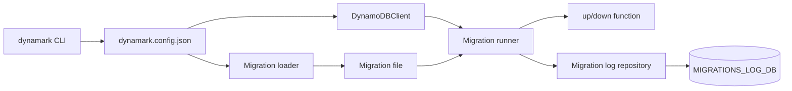

# dynamark

`dynamark` is a DynamoDB data migration CLI for TypeScript and JavaScript projects.

It is a modernized successor to `dynamo-data-migrations`: Node 24+, AWS SDK for JavaScript v3, `dynamark.config.json`, runtime config validation, Vite builds, and Vitest coverage.

## Install the CLI

```bash
npm install -g dynamark
```

```bash
dynamark --help
```

## Create a Migration Project

```bash
dynamark init
```

`init` creates:

- `dynamark.config.json`
- `migrations/`

The generated `dynamark.config.json` starts as:

```json
{
  "awsConfig": [
    {
      "profile": "",
      "region": "us-west-2",
      "endpoint": "",
      "accessKeyId": "",
      "secretAccessKey": ""
    }
  ],
  "migrationsDir": "migrations",
  "migrationType": "ts"
}
```

For real AWS, leave `endpoint`, `accessKeyId`, and `secretAccessKey` blank if you want Dynamark to load credentials from the selected AWS profile.

## Run Against DynamoDB Local

Start DynamoDB Local:

```bash
docker run -d -p 8000:8000 --name local-dynamodb amazon/dynamodb-local
```

Set throwaway local credentials for AWS CLI calls:

```bash
export AWS_ACCESS_KEY_ID=local
export AWS_SECRET_ACCESS_KEY=local
export AWS_DEFAULT_REGION=us-west-2
```

Create a local table you can use in a migration:

```bash
aws dynamodb create-table \
  --table-name TestTable \
  --attribute-definitions AttributeName=id,AttributeType=S \
  --key-schema AttributeName=id,KeyType=HASH \
  --billing-mode PAY_PER_REQUEST \
  --endpoint-url http://localhost:8000
```

Confirm DynamoDB Local is responding:

```bash
aws dynamodb list-tables --endpoint-url http://localhost:8000
```

Point `dynamark.config.json` at the local endpoint:

```json
{
  "awsConfig": [
    {
      "profile": "",
      "region": "us-west-2",
      "endpoint": "http://localhost:8000",
      "accessKeyId": "local",
      "secretAccessKey": "local"
    }
  ],
  "migrationsDir": "migrations",
  "migrationType": "ts"
}
```

## Run Migrations

Create a migration:

```bash
dynamark create add-test-row
```

Example TypeScript migration:

```ts
import type { DynamoDBClient } from "@aws-sdk/client-dynamodb";
import { DeleteItemCommand, PutItemCommand } from "@aws-sdk/client-dynamodb";

export async function up(ddb: DynamoDBClient): Promise<void> {
  await ddb.send(
    new PutItemCommand({
      TableName: "TestTable",
      Item: {
        id: { S: "row-1" }
      }
    })
  );
}

export async function down(ddb: DynamoDBClient): Promise<void> {
  await ddb.send(
    new DeleteItemCommand({
      TableName: "TestTable",
      Key: {
        id: { S: "row-1" }
      }
    })
  );
}
```

Run and inspect migrations:

```bash
dynamark up
dynamark status
dynamark down --shift 1
```

`dynamark up` creates `MIGRATIONS_LOG_DB` automatically if it does not exist. That table stores the migration filename and applied timestamp.

## Runtime Flow



## Build and Test This Repo

Use Node 24+.

```bash
npm install
npm run check-types
npm test
npm run build
npm run check
```

The default test suite uses Vitest and an in-process Dynalite server for fast local and CI feedback.

To test against the Docker DynamoDB Local container on `localhost:8000`:

```bash
docker run -d -p 8000:8000 --name local-dynamodb amazon/dynamodb-local
npm run test:local:dynamodb
```

The Docker smoke test owns and resets `DYNAMARK_LOCAL_TEST` and `MIGRATIONS_LOG_DB` inside DynamoDB Local.

## Docs

- [Architecture](docs/architecture.md)
- [Migrating from dynamo-data-migrations](docs/migrating-from-dynamo-data-migrations.md)
