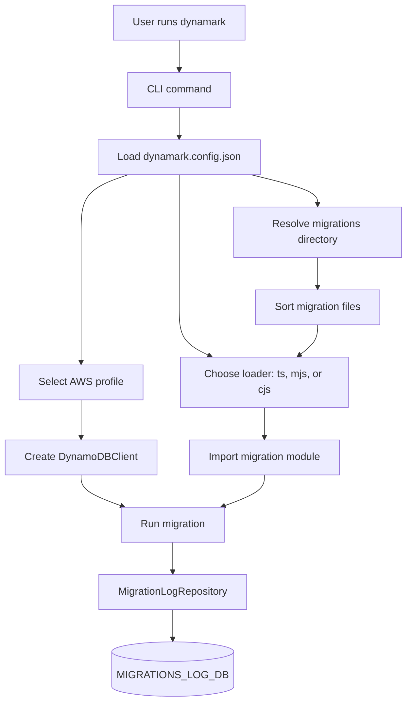
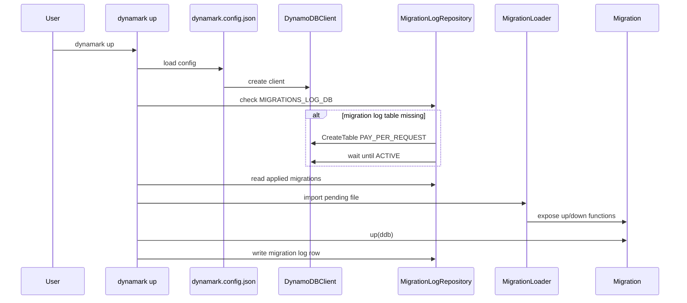
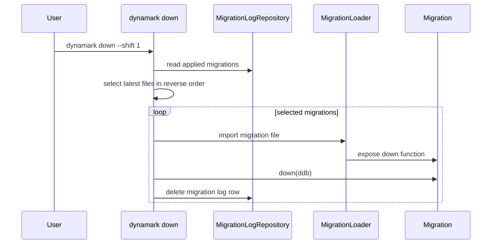
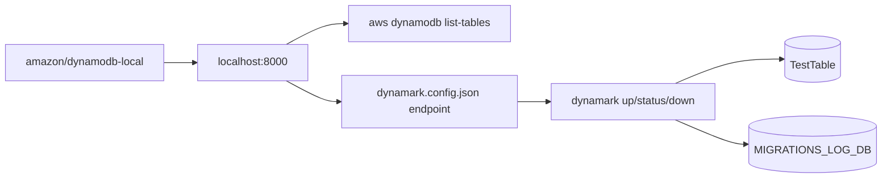

# Dynamark Architecture

`dynamark` has one job: run ordered migration files against DynamoDB and record what ran in `MIGRATIONS_LOG_DB`.

## Runtime Model

## Config Boundary

`dynamark.config.json` is the project-level control point:

- `awsConfig` selects region, optional endpoint, and credentials.
- `migrationsDir` tells Dynamark where migration files live.
- `migrationType` chooses the loader strategy: `ts`, `mjs`, or `cjs`.

Local DynamoDB works by setting `endpoint` to `http://localhost:8000` and using throwaway credentials. Real AWS usage leaves `endpoint` blank and can load credentials from the shared AWS profile.

## Up Flow

## Down Flow

## Local Test Loop

## Code Boundaries

- CLI commands live in `src/bin/dynamark.ts` and call action functions.
- Action functions own the user-visible workflows: `init`, `create`, `up`, `down`, and `status`.
- Environment modules own config loading, DynamoDB client creation, migration directory lookup, and migration log storage.
- File loaders keep runtime migration imports separate from the bundled CLI so user migration files still load from the project `migrations/` directory.
