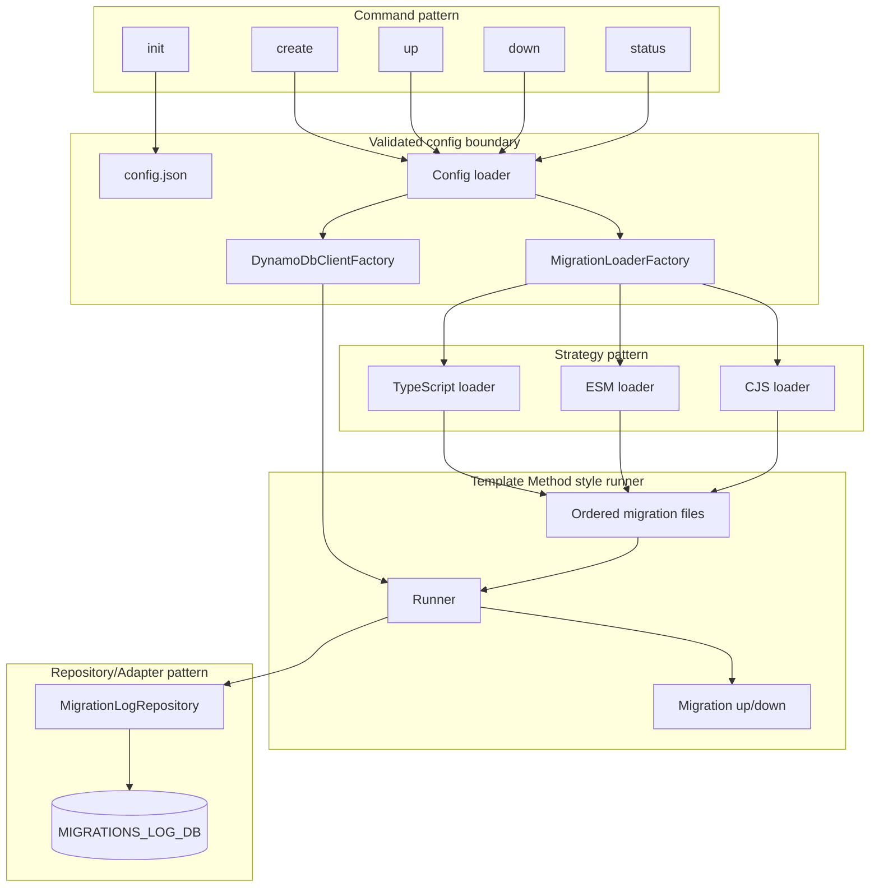
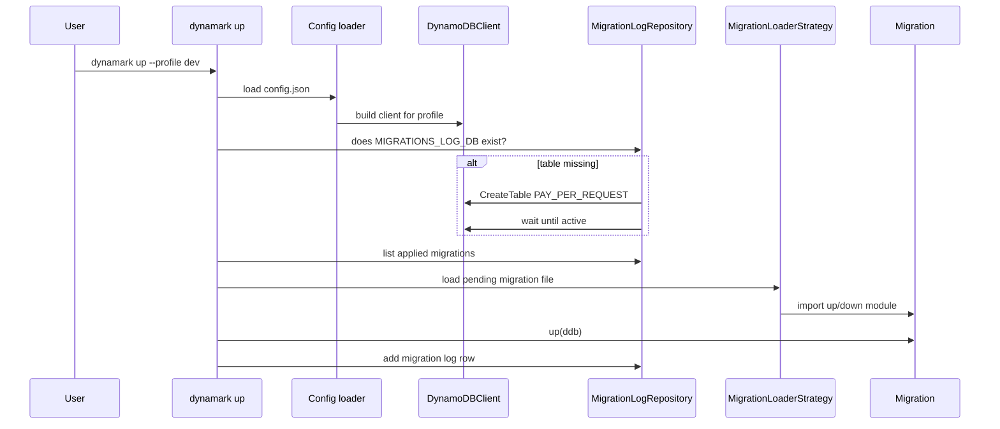
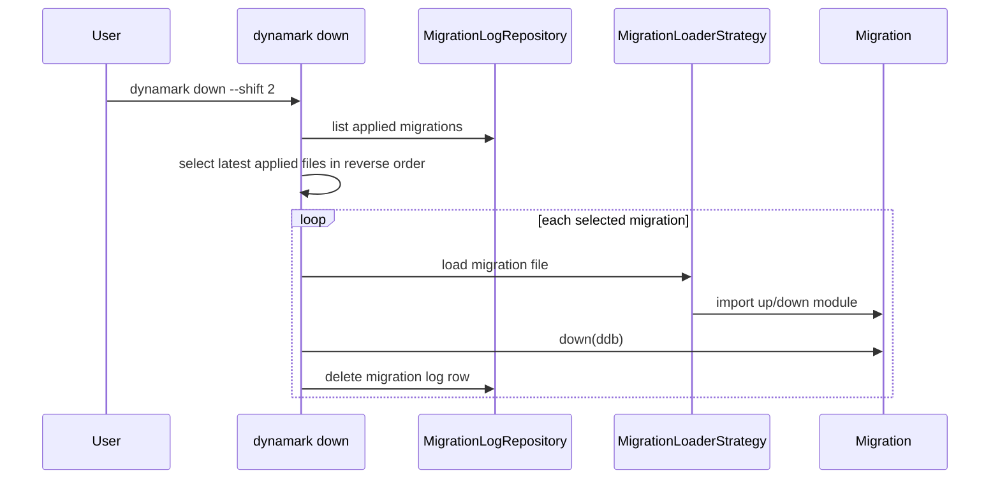

# Dynamark Architecture

`dynamark` keeps the domain small: a CLI reads migration config, loads ordered migration files, runs each migration against DynamoDB, and records applied files in `MIGRATIONS_LOG_DB`.

## Component View

## Up Flow

## Down Flow

## Patterns

- `Command`: each CLI command maps to one small action module.
- `Strategy`: `ts`, `mjs`, and `cjs` migration loaders share the same interface.
- `Factory`: config chooses the AWS client and migration loader.
- `Repository/Adapter`: DynamoDB log table access lives in `MigrationLogRepository`.
- `Template Method style`: `up` and `down` share the same high-level pipeline: resolve files -> load migration -> execute -> update log.

The point is debuggability. If migration loading fails, inspect the Strategy layer. If log writes fail, inspect the Repository layer. If AWS profile selection fails, inspect the Factory/config boundary.
