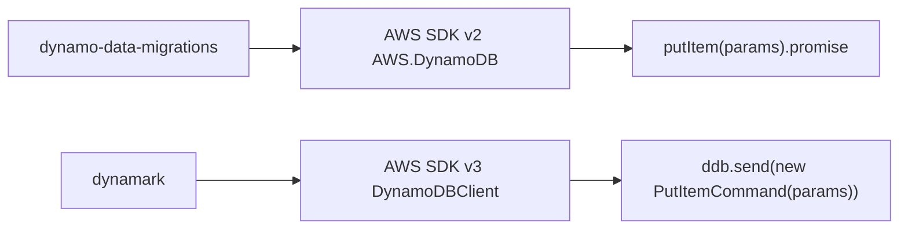

# Migrate From dynamo-data-migrations

`dynamark` is a breaking modernization. It does not keep the old CLI alias or AWS SDK v2 migration API.

## Rename CLI Commands

```bash
# old
dynamo-data-migrations init
dynamo-data-migrations create add_customer
dynamo-data-migrations up --profile dev

# new
dynamark init
dynamark create add_customer
dynamark up --profile dev
```

## Update Package Runtime

```json
{
  "name": "dynamark",
  "repository": {
    "type": "git",
    "url": "https://github.com/gizmodlabs/dynamark.git"
  }
}
```

The supported runtime is Node 24+.

## Replace AWS SDK v2 Calls

Old migrations received `AWS.DynamoDB` from the AWS SDK v2 monolith.

```ts
import AWS from "aws-sdk";

export async function up(ddb: AWS.DynamoDB) {
  await ddb
    .putItem({
      TableName: "CUSTOMER",
      Item: {
        CUSTOMER_ID: { S: "customer-1" }
      }
    })
    .promise();
}
```

New migrations receive `DynamoDBClient` from AWS SDK v3.

```ts
import type { DynamoDBClient } from "@aws-sdk/client-dynamodb";
import { PutItemCommand } from "@aws-sdk/client-dynamodb";

export async function up(ddb: DynamoDBClient): Promise<void> {
  await ddb.send(
    new PutItemCommand({
      TableName: "CUSTOMER",
      Item: {
        CUSTOMER_ID: { S: "customer-1" }
      }
    })
  );
}
```

## Move Config To dynamark.config.json

`dynamark` reads `dynamark.config.json`. `endpoint` is supported per profile for local DynamoDB-compatible services like Docker DynamoDB Local.

```json
{
  "awsConfig": [
    {
      "profile": "",
      "region": "us-west-2",
      "endpoint": "http://localhost:8000",
      "accessKeyId": "local",
      "secretAccessKey": "local"
    }
  ],
  "migrationsDir": "migrations",
  "migrationType": "ts"
}
```

If `accessKeyId` and `secretAccessKey` are omitted, `dynamark` loads credentials from the shared AWS credentials file for the selected profile.

## Old API -> New API



## Checklist

- Replace CLI calls with `dynamark`.
- Install AWS SDK v3 command imports in migration files.
- Change `AWS.DynamoDB` types to `DynamoDBClient`.
- Replace `.promise()` calls with `ddb.send(new SomeCommand(params))`.
- Rename project config to `dynamark.config.json`.
- Set `migrationType` to `ts`, `mjs`, or `cjs`.
- Run `dynamark status` against a safe environment before applying migrations.
